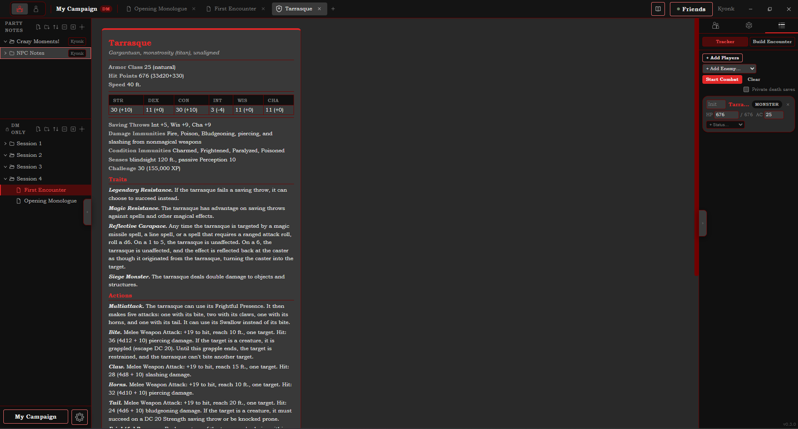
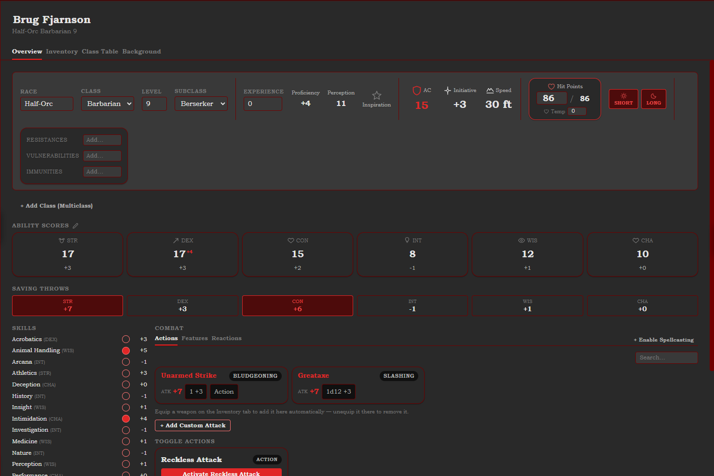
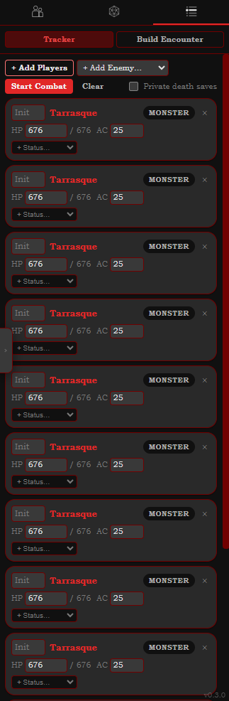

# NoteGoblin

A desktop D&D campaign companion for DMs and players — notes, character sheets, combat tools, and a shared dice tray, synced live between everyone at the table over the internet (no LAN, port forwarding, or third-party VTT required).

Built with Electron, React, and TypeScript.

## Features

### Notes
- An Obsidian-style live-preview markdown editor — headings, bold/italic, tables, and images render inline as you type, un-rendering back to raw syntax right where your cursor is.
- `[[Wikilinks]]` between notes, with autocomplete and click-to-navigate.
- Three visibility tiers per note/folder: **Party** (shared with everyone), **DM Only**, and **Private** (visible only to its author, not even the DM).
- Drag-and-drop or pasted images, embedded inline.
- Rendered `​```statblock` code blocks display as a formatted D&D stat block card, and can be saved straight to your Codex.
- Inline dice rolls: writing `` `dice: 2d6 + 3` `` as inline code turns it into a clickable roll button, logged to the shared Dice Tray.
- Optional opt-in local file storage — keep a campaign as real Markdown files in a folder of your choice (Obsidian-vault-compatible) instead of the app's internal database.

### Character Sheets
- Full character creation and level-up flow across every SRD class, covering class features, subclass features, Ability Score Improvements, feats, spellcasting, and multiclassing.
- The level-up popup walks through new features and any choices they grant (fighting styles, subclass picks, Metamagic, Eldritch Invocations, Magical Secrets, and more) one step at a time.
- Automatic AC, HP, initiative, speed, and attack/spell bonus calculations — including class features like Unarmored Defense, Rage, Sneak Attack, and feat-granted bonuses.
- An Actions tab covering attacks, spells, bonus actions, reactions, and class resources (Rage, Ki, Channel Divinity, Wild Shape, and the rest) in one place.

### Combat & Encounters
- A live-synced initiative tracker with HP/AC/status effects, death saves, and a play mode that steps through turns — visible to the DM in full, and to players as an injury-band view that never reveals exact enemy stats.
- An encounter builder with SRD difficulty math, XP budgeting, and saved encounters.
- Click an enemy in the tracker to open its statblock in its own tab.

### Codex
- A searchable SRD reference for monsters, equipment, spells, and magic items, with filters for each.
- Import a monster's statblock straight into a note, or save one you've written back into the Codex.

### Dice Tray
- Roll any number of any standard die (d4–d100) plus a modifier, with one labeled button per die type.
- Every roll lands in a log shared live by the whole table — who rolled, the formula, the total, and the full breakdown.
- Private rolls: everyone else sees that you rolled, but the result stays visible only to you.

### Playing Together
- No hosting infrastructure to set up — a DM starts a session and invites friends from an in-app Friends list; players join with one click, over a relay server rather than a direct LAN/IP connection.
- Live sync for notes, character sheets, initiative, and dice rolls while connected.
- A read-only offline snapshot of the last-synced campaign stays browsable for players even when the DM isn't currently hosting.
- Auto-updates via GitHub Releases.

## Tech Stack

- **App shell:** Electron + React + TypeScript, built with `electron-vite`
- **Editor:** CodeMirror 6, with a custom Obsidian-style live-preview layer
- **Local data:** SQLite (`better-sqlite3`), with an optional file-based vault mode
- **Multiplayer:** a Cloudflare Workers relay (see `relay/`) brokering WebSocket sessions between a hosting DM and connecting players — the relay only ever forwards opaque messages, it never sees campaign content

## Getting Started

```bash
npm install
npm run dev
```

Other scripts:

```bash
npm run build        # production build (unpacked)
npm run build:win     # packaged Windows installer
npm run typecheck     # type-check the whole project
npm run relay:dev     # run the Cloudflare Workers relay locally
```

## Project Structure

```
src/main/        Electron main process — IPC handlers, session hosting/joining, local DB access
src/preload/      Context-bridge API exposed to the renderer
src/renderer/     The React app (UI)
src/server/       Relay client/protocol code shared by the main process
shared/           Types and game-rule logic shared between main and renderer
relay/            The Cloudflare Workers relay (Durable Objects) that brokers live sessions
db/               SQLite schema
```

## Screenshots

**Notes, with a saved Codex statblock and the live initiative tracker open alongside**


**Character sheet — automatic AC/HP/attacks, class resources, and toggleable features like Reckless Attack**


**Initiative tracker, tracking HP/AC/status effects for a full encounter**

